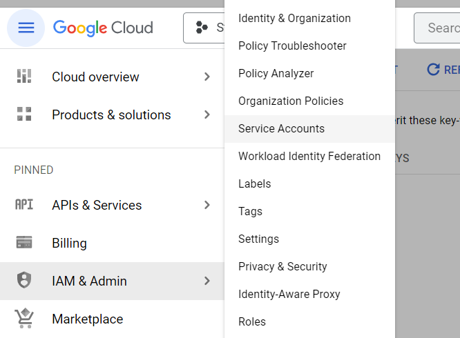

# Spotify Monthly Recommendation Data ETL Pipeline
This is an ETL pipeline implemented using GCP, Prefect, Docker, PySpark, Flask and Python, it contains

* User defined functions.
* extraction of data from Spotify API using flask for Oauth2.0.
* transformation of the data to desired format.
* loading the transformed data to GCS.
* loading the data to Google Bigquery.
* using the data to generate a looker report


## Prerequisite
A GCP account, pretty easy to make and a little bit knowledge of cloud, linux, sql and python.


## About the project
The project has 5 python files 

* Extract.py</br>
This file contains the code to extract the data using Spotify API using Oauth2.0, 
the code extracts the json data and puts it in the API_DATA folder, after running the file click on the link 
it will open a browser window and start downloading your files.

* Load.py </br>
this part of the code uploads the json files extracted in  API_data to GCP bucket.

* Transform1.py </br>
this file extracts the required data from the JSON files using json handling.

* Transform2.py </br>
this file uses PySpark to run some transformation on the data to make it into the desirable format and saves it as the final json file.

* load_to_bq.py </br>
this file loads the final data in API_DATA_CLEAN to Google BigQuery using prefect.

## How to run the project
To run the project create a VM instance, generate the SSH keys for it 
[GCP SSH keys](https://cloud.google.com/compute/docs/connect/create-ssh-keys "GCP SSH_key Gen"), update the SSH key in the metadata section of the VM.


then spin up a VM, create a Service account that will be used later to load data to GCS and BQ

provide the service account with appropriate access, 
Storage Admin, Storage Object Admin and Big Query Admin should be sufficient. Generate keys for the service account(this wil be used later in prefect blocks).

*  create a storage bucket.
[GCP Storage Bucket](https://cloud.google.com/storage/docs/creating-buckets "GCP Storage Bucket").

* Also Create a Bigquery Dataset and Table for table provide the schema(bq_schema.json) thats in the files.
[GCP 
BigQuery Datasets](https://cloud.google.com/bigquery/docs/datasets "GCP 
Bigquery Datasets").


* After cloud setup, setup a prefect cloud account 
[prefect Cloud](https://docs.prefect.io/2.10.21/cloud/cloud-quickstart/), or you can run the prefect server locally.

* Login to your prefect cloud, go to blocks, search GCP Credentials and create a prefect block.

just add the required details

* create a GCS Bucket block using the same steps above and the bucket we created using while setting up GCP cloud.

* Then login to your prefect Cloud account using Console
using the command 
```
$ prefect cloud login
```
It will ask for API key, you can get that generated from your profile section on Prefect cloud.

* Then run the load.py file using 
```
python load.py
```
or if you want to run specific files, you can also do that, just replace the load.py file name with the script you want to run.

* After the data is successfully in the BQ, you can test that out by querying the table using BQ query tool.

* then click on Explore Data Option


That should route you to looker, create an account and then you can crate a report using the Data in your BQ table.
[Looker Report](https://support.google.com/looker-studio/answer/12141699?hl=en#:~:text=a%20product%20integration-,Create%20a%20new,Sign%20in%20to%20Looker%20Studio.&text=Create%2C%20then%20select%20Report.,data%20and%20My%20data%20sources "Looker Report").

Some Example Screenshots.


## Extras
Have included the dockerfile also if anyone wants to run the flask app on docker.

## Tips
You can also create it like a cron job that runs on a specific day of every month using either prefect deployment or putting it into cloud run function.

[GCP Cloud Function Job](https://cloud.google.com/blog/products/application-development/how-to-schedule-a-recurring-python-script-on-gcp "GCP Cloud Function Job")

